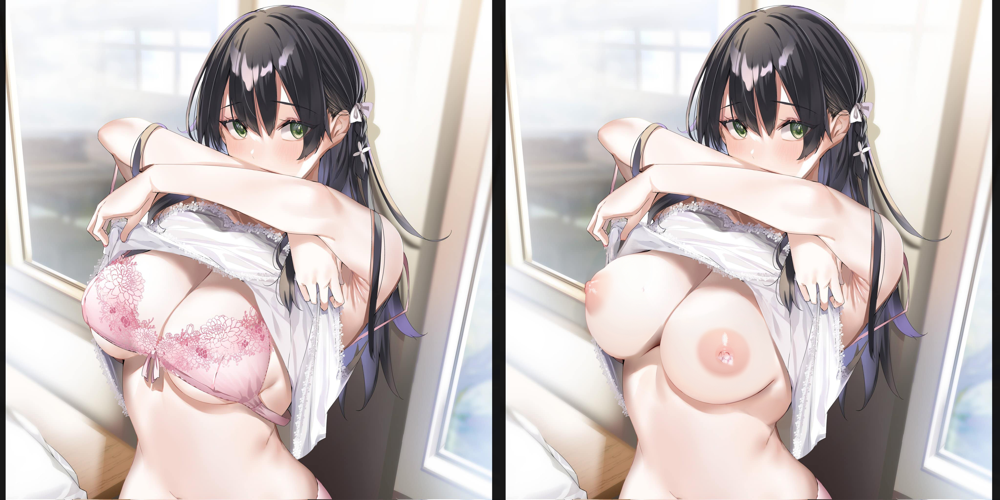

# KÍNH CHIẾU SẾCH AI V2

Mình nghịch dựa trên ý tưởng của một viral clip gần đây về việc đồng bộ vị trí của phần tử khi mở nhiều cửa sổ trình duyệt khác nhau chấp cả việc cửa sổ trình duyệt có di chuyển hay thay đổi kích cỡ như thế nào đi nữa [(Link video)](https://twitter.com/_nonfigurativ_). Kết hợp sử dụng Stable Diffusion API để redraw lại chỗ cần redraw 🤤



[Kết quả demo](https://drive.google.com/drive/folders/19o8ouxhoket-q_EdbfeAVEIWl2ACuapF?usp=sharing/)

- **react-draggable**: Giúp kéo ảnh di chuyển
- **Broadcast Channel API**: Trao đổi thông tin giữa các cửa sổ
- **[Stable Diffusion WebUI](https://github.com/AUTOMATIC1111/stable-diffusion-webui)**: Cung cấp API cho việc inpaint
- **[react-mask-editor](https://github.com/la-voliere/react-mask-editor)**: Tạo mask chỗ cần redraw (thư viện này lỗi phải tự viết lại 😓)

> Update V2 kết hợp với Stable Diffusion để redraw ra con art cook nhất 🧑‍🍳🔥🔥

# Chạy code này như thế nào?

Hỏi câu này thì khả năng cao bạn không phải dev, cứ nghịch demo ở trên nhé.

Còn trường hợp muốn mày mò thì 👇

[How To Run an Existing React App In VSCode](https://www.youtube.com/watch?v=rUdOf63M_WA&ab_channel=GhostTogether).

# Chạy phiên bản kết hợp Stable Diffusion AI
Frontend bên nhánh stable-diffusion. 


## Cài đặt Stable Diffusion WebUI

Rất đầy đủ tại repo của [stable-diffusion-webui](https://github.com/AUTOMATIC1111/stable-diffusion-webui#installation-and-running).

Nếu bạn không phải dev thì nên xem tutorial hướng dẫn [tại đây](https://www.youtube.com/watch?v=14W__bxStMc&ab_channel=FrankTheTank).

### Một số lưu ý

- Khi cài python phải cài đúng bản [3.10.6](https://www.python.org/downloads/release/python-3106/).
- Chạy file webui-user.bat để sử dụng SD WebUI.
- Nếu trong quá trình generate ảnh mà bị lỗi hoặc ra kết quả như cc, sửa file webui-user.bat như sau:

```bash
@echo off

set PYTHON=
set GIT=
set VENV_DIR=
set COMMANDLINE_ARGS= --precision full --no-half --opt-sub-quad-attention --lowvram --disable-nan-check

call webui.bat
```
- Nếu vẫn còn bị lỗi thì do máy bạn không đủ sức theo cuộc chơi này rồi.

## Chuẩn bị để có thể redraw

- Sửa file webui-user.bat như sau và chạy:
```bash
@echo off

set PYTHON=
set GIT=
set VENV_DIR=
set COMMANDLINE_ARGS= --api --cors-allow-origins *

call webui.bat
```

- Download [meinahentai inpaint model](https://civitai.com/models/12606?modelVersionId=119992) vào thư mục ../stable-diffusion-webui/models/Stable-diffusion

- Chạy frontend 🔥

## Sử dụng Stable Diffusion WebUI trực tiếp

- Thật ra frontend mình làm cho vui, xịn làm sao như WebUI thật được.

- Mở http://127.0.0.1:7860/ và vào tab img2img -> vào tab Inpaint -> Upload ảnh vào tô chỗ cần redraw 😉

- Nhớ tích Fill, Only masked content -> Generate

- Chờ 1 lát và sụccccccc 💦